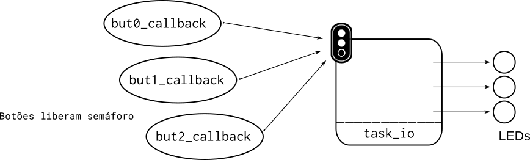
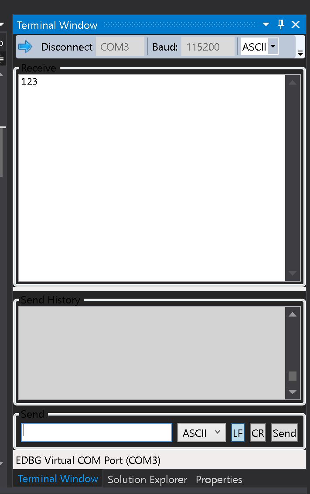
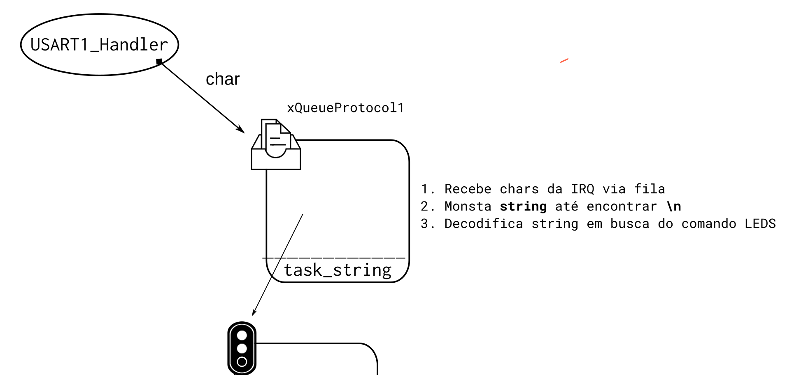
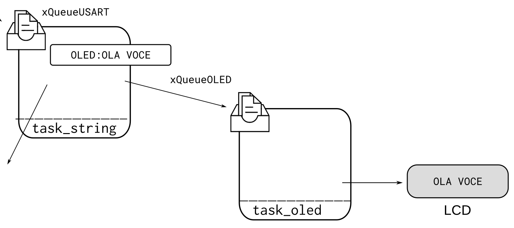

# Prática RTOS

> Baseado na AVS de 19b

1. Você não deve utilizar função de delay, que não a do RTOS
1. Você não deve utilizar variáveis globais, que não fila ou queue

A entrega deve ser a implementação do diagrama a seguir:


## Task I/O

> Os LEDs são nossos amigos!

Ignore por ora a tarefa `task_string`, que já está no código.

Utilizando o OLED1, crie uma **ÚNICA** tarefa (`task_io`) que faz a inicialização dos LEDs e botões 
da placa OLED. Configure os botões para gerarem interrupção quando forem pressionados. Os botões devem controlar se os LEDs estão piscando ou não (todos os LEDs piscam juntos).

Para cada botão da placa, associe um `callback` a eles: `button0_callback`, `button1_callback`, `button2_callback`.

Crie um semáforo (`xSemaphoreLED`) que servirá de comunicação entre os callbacks e a tarefa, mude o estado do piscar dos LEDs (primeira vez, todos os LEDs piscam, segunda param de piscar, ...) utilizando o semáforo.

Implemente a função `led_on(uint id, on)` que será responsável por controlar os LEDs. O primeiro parâmetro deve ser
qual led será controlado `0`, `1`, `2`, e o segundo se o LED será aceso (`1`) ou apagado (`0`). Utilize essa função para fazer os LEDs piscarem.


1. Crie uma nova task `task_io`
1. Crie um semáforo que fará o controle se os LEDs devem piscar ou não: `xSemaphoreLED`
1. Inicialize os botões (callback) e LEDs da placa OLED1
    - libere o `xSemapareLED` sempre que um botão for apertado.
1. Implemente a função `led_on`
1. Faça os LEDs piscarem
1. Faça os callbacks mudarem o estado dos LEDs (toggle).



## Task string

O código demo que vocês receberam possui uma task: `task_string`,
essa tarefa é responsável por ler do periférico USART1 uma sequência de caracteres 
e montar uma string até quando encontrar o terminador (EOP) **`\n`**.  Ao finalizar a string, faz o envio da mesma para o terminal.

> Configure o terminal em 115200, com `\n`.

{width=45%}

Para validar, envie um texto pela UART e você deverá receber o mesmo de volta.

### Controlando os LEDs via UART

Nosso objetivo agora é que não só os `callbacks` dos botões controlem os LEDs, mas 
desenvolver um protocolo de comunicação entre o PC e o uC para controle desses LEDs. Vamos começar com algo bem simples, se 
enviarmos a string a seguir via o terminal: `"LEDS\n"` a tarefa `task_string` deve liberar o semáforo da `task_io`.

Para isso, crie uma função `protocol_check_led(char *string)` que recebe uma string, e retorna `1` se detectado `LEDS` e 0 se detectado qualquer outra coisa.

1. Criar função `protocol_check_led` que detecta a string "LEDS"
1. Liberar semáforo `blink_io` caso recebido o comando correto.

### Otimizando

Para a montagem da string na `task_string` realizamos o pooling 
no periférico USART para verificar se existe um novo caracter que possa ser lido:

```c
if(usart_serial_is_rx_ready(CONF_UART)){

}
```

Isso é pouco eficiente, o melhor seria essa tarefa executar apenas quando um caracter já tiver
sido decodificado pelo USART. Para isso iremos utilizar IRQ (`USART1_Handler`)do periférico USART para tarefa 
`task_string`. 

Toda vez que um dado estiver pronto para ser lido da USART, iremos cair em uma interrupção e então 
enviar os dados via uma fila para a tarefa `task_string`. Que irá agora construir a string a partir
de dados na fila e não acessando diretamente a USART.

Para isso:

1. Crie uma fila de `char` na tarefa: `xQueueUART`
1. Ative a IRQ da UART1 para recepção dos dados
1. No `USART1_Handler` leia o dado da USART1 e coloque na fila
1. Na `task_string` faça a leitura da fila e crie a string

Para ativar interrupção da USART, use o trecho de código a seguir:

```c
  // Ativa interrupcao UART1 na recpcao de daods
  usart_enable_interrupt(CONF_UART, US_IER_RXRDY);
  NVIC_EnableIRQ(CONSOLE_UART_ID);
  NVIC_SetPriority(CONSOLE_UART_ID, 5);
```



### Task OLED

Crie uma nova tarefa que será responsável por gerenciar o display do OLED1, essa tarefa deve possuir
uma fila `xQueueOLED`, todo dado que chegar nessa fila deve ser exibido no OLED1. 

1. Crie a tarefa `task_oled`
1. Inicialize o OLED
1. Teste se OLED está funcionando
1. Crie uma nova fila de strings: `xQueueOLED`
    - pense onde é melhor criar essa fila!
1. Toda nova string que vier na fila deve ser escrita no OLED.

Para inicializar o display, chame a função a seguir:

```c
gfx_mono_ssd1306_init();
```

Para testar, escreva na tela:

```c
gfx_mono_draw_string("mundo", 50,16, &sysfont);
```

### Modificando task_string

Modifique a função `task_string`, para que toda vez que vier o comando: `OLED:lalalalal` a parte do 
`lalalalal` seja enviado para a `task_oled` e então exibida no OLED.




## Necessário

Ao final você deve ter:

- `task_io`
    - inicializa botões
    - inicializa LEDs
    - botões controlam piscar dos LEDs
        - via semáforo
- `task_string`
    - interpretando comando da serial
    - controla leds por comando
        - via semáforo
    - Otimizando task
        - IRQ -> UART -> task_string
    - novo comando: OLED:string
    - envia string para task_oled exibir.
- `task_oled`
    - inicializa OLED
    - recebe o que será exibido via fila
